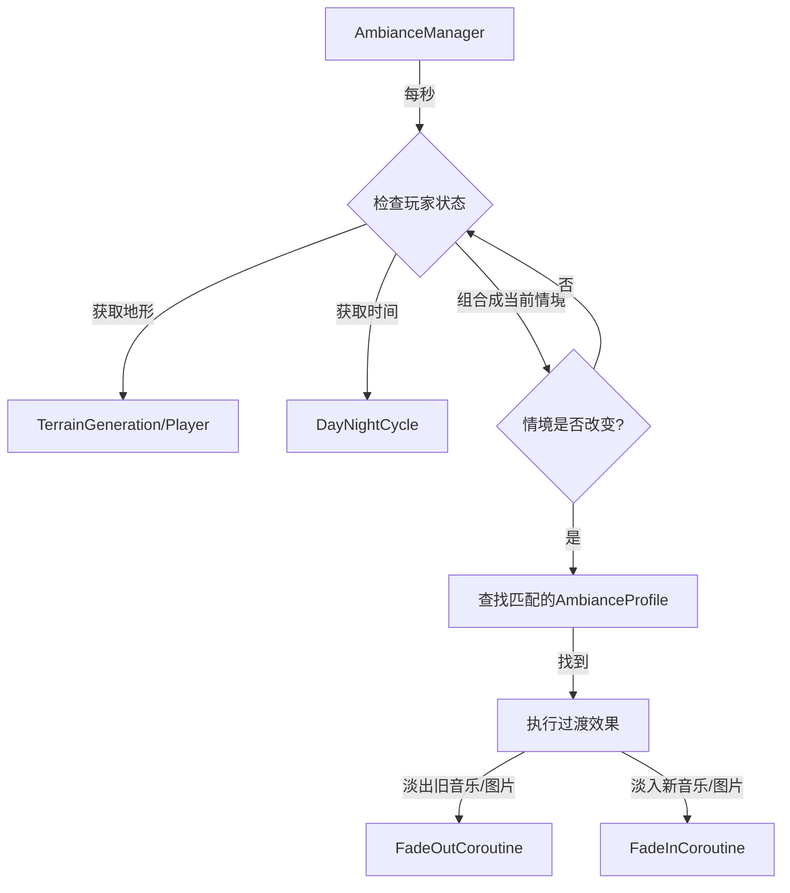

# Dynamic Ambiance System

This document outlines the architecture for a system that dynamically changes background images and music based on the player's current biome and the in-game time of day.

## 1. Core Requirements

-   **Contexts:** Support for 4 biomes (Forest, Desert, Surface, Cave) and 2 times of day (Day, Night).
-   **Assets:** Each context will have a unique, single background image and a single looping audio clip.
-   **Transitions:** All transitions for both images and music will be handled with a smooth fade effect.

## 2. Design

### Data Structure

The system will use `ScriptableObject` to define the ambiance for each context. This allows for easy configuration in the Unity Editor without code changes.

-   **`AmbianceProfile.cs` (ScriptableObject):**
    -   `biome` (enum): The biome type (`Forest`, `Desert`, `Surface`, `Cave`).
    -   `timeOfDay` (enum): The time of day (`Day`, `Night`).
    -   `backgroundImage` (Sprite): The background image for the context.
    -   `backgroundMusic` (AudioClip): The background music for the context.

### Core Manager

A singleton `AmbianceManager.cs` will manage all system logic.

-   **Responsibilities:**
    1.  Maintain a list of all `AmbianceProfile` assets.
    2.  Periodically check the player's current biome and the time of day.
    3.  Find the matching `AmbianceProfile` when the context changes.
    4.  Execute smooth transitions for the background image and music.
-   **Required Components:**
    -   Two `AudioSource` components for music crossfading.
    -   Two UI `Image` components for background image fading.

### System Flowchart

## 3. Implementation Steps

1.  **Create Enums:** Define `BiomeType` and `TimeOfDay` enums in a new script.
2.  **Create `AmbianceProfile`:** Implement the `AmbianceProfile.cs` ScriptableObject.
3.  **Create `AmbianceManager`:** Implement the `AmbianceManager.cs` singleton.
4.  **Set up UI:** Create a Canvas with two `Image` components for the background.
5.  **Implement Logic:** Code the state detection and transition effects in the manager.
6.  **Create Assets:** In the editor, create `AmbianceProfile` assets for each context and assign the corresponding images and music.
7.  **Integrate:** Connect the `AmbianceManager` with other systems (e.g., `PlayerController`, `TerrainGeneration`) as needed.